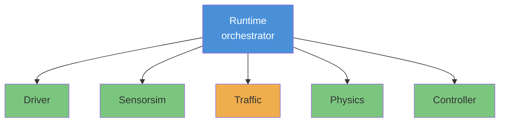
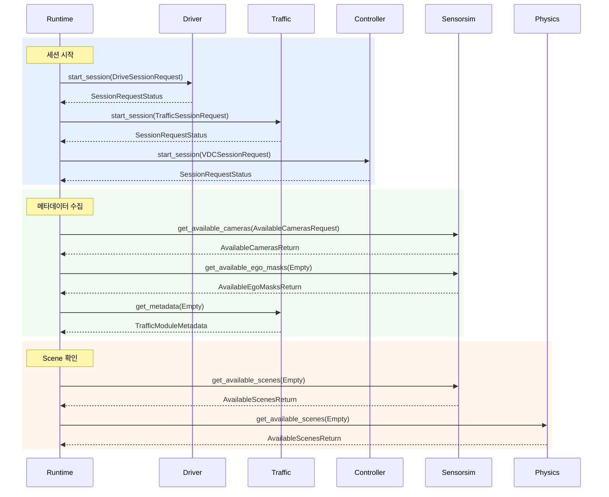
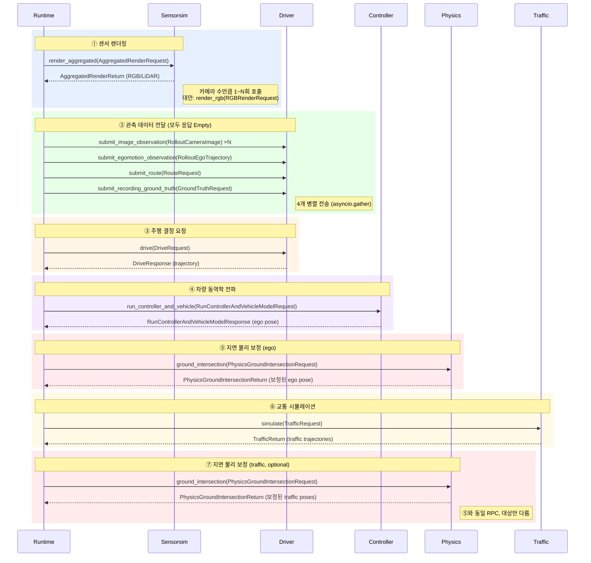
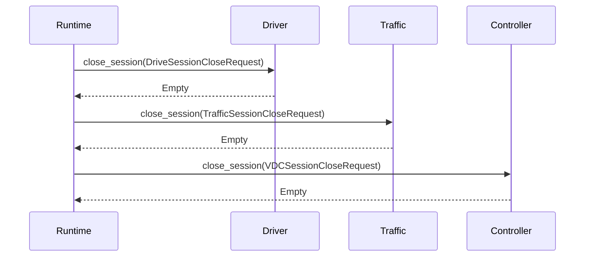
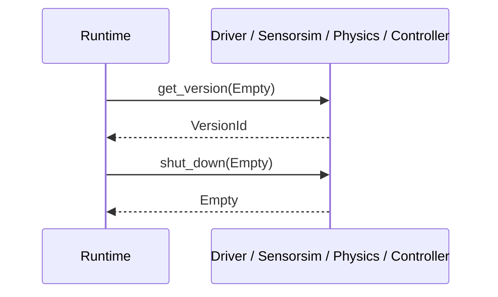

# gRPC Communication Topology

Runtime이 중앙 오케스트레이터로, 나머지 5개 서비스를 호출하는 **허브-스포크(hub-spoke)** 구조.
서비스 간 직접 통신은 없음. 모든 RPC는 Unary (요청 1개 → 응답 1개).

> 🟢 이 레포에 서버 구현 있음 &nbsp;&nbsp; 🟡 외부 서비스 / 미구현

---

## 시뮬레이션 루프 (메인 통신 흐름)

진입점: 외부에서 `RuntimeService.simulate(SimulationRequest)` 호출 → Runtime이 아래 흐름을 오케스트레이션

클라이언트 공통 베이스: `src/runtime/alpasim_runtime/services/service_base.py`
- Line 75: `self.channel = grpc.aio.insecure_channel(self.address)` (채널 생성)

### 세션 초기화 단계

#### 세션 초기화 코드 참조

| RPC | client | server |
|-----|--------|--------|
| Driver.start_session | driver_service.py:108 | main.py:734 |
| Traffic.start_session | traffic_service.py:202 | (외부 서비스) |
| Controller.start_session | controller_service.py:108 | server.py:48 |
| Sensorsim.get_available_cameras | sensorsim_service.py:101 | (외부 서비스) |
| Sensorsim.get_available_ego_masks | sensorsim_service.py:134 | (외부 서비스) |
| Traffic.get_metadata | traffic_service.py:119 | (외부 서비스) |
| Sensorsim.get_available_scenes | service_base.py:170 | (외부 서비스) |
| Physics.get_available_scenes | service_base.py:170 | server.py:128 |

---

### 매 control step 루프

#### 매 control step 코드 참조

| # | RPC | Request → Response | client | server |
|---|-----|-------------------|--------|--------|
| ① | Sensorsim.render_aggregated | `AggregatedRenderRequest` → `AggregatedRenderReturn` | sensorsim_service.py:276 | (외부 서비스) |
| ① | Sensorsim.render_rgb (대안) | `RGBRenderRequest` → `RGBRenderReturn` | sensorsim_service.py:335 | (외부 서비스) |
| ② | Driver.submit_image_observation | `RolloutCameraImage` → `Empty` | driver_service.py:147 | main.py:783 |
| ② | Driver.submit_egomotion_observation | `RolloutEgoTrajectory` → `Empty` | driver_service.py:178 | main.py:809 |
| ② | Driver.submit_route | `RouteRequest` → `Empty` | driver_service.py:200 | main.py:838 |
| ② | Driver.submit_recording_ground_truth | `GroundTruthRequest` → `Empty` | driver_service.py:225 | main.py:857 |
| ③ | Driver.drive | `DriveRequest` → `DriveResponse` | driver_service.py:270 | main.py:868 |
| ④ | Controller.run_controller_and_vehicle | `RunControllerAndVehicleModelRequest` → `RunControllerAndVehicleModelResponse` | controller_service.py:181 | server.py:66 |
| ⑤⑦ | Physics.ground_intersection | `PhysicsGroundIntersectionRequest` → `PhysicsGroundIntersectionReturn` | physics_service.py:79 | server.py:69 |
| ⑥ | Traffic.simulate | `TrafficRequest` → `TrafficReturn` | traffic_service.py:280 | (외부 서비스) |

---

### 세션 종료 단계

#### 세션 종료 코드 참조

| RPC | client | server |
|-----|--------|--------|
| Driver.close_session | driver_service.py:118 | main.py:760 |
| Traffic.close_session | traffic_service.py:216 | (외부 서비스) |
| Controller.close_session | controller_service.py:124 | server.py:56 |

---

### 공통 RPC

> **참고**: TrafficService proto에는 `get_version`이 정의되어 있지 않음. `get_metadata`로 버전 정보를 포함하여 반환.

#### 공통 RPC 코드 참조

| RPC | client | server |
|-----|--------|--------|
| get_version | service_base.py:156 | 각 서비스의 get_version() |
| shut_down | simulate/\_\_main\_\_.py:137 | 각 서비스의 shut_down() |

---

### 시뮬레이션 루프에서 사용되지 않는 Proto RPC

| 서비스 | RPC | Request → Response | 비고 |
|--------|-----|--------------------|------|
| SensorsimService | `render_lidar` | `LidarRenderRequest` → `LidarRenderReturn` | `render_aggregated`가 LiDAR를 포함하므로 별도 호출 없음 |
| SensorsimService | `get_available_trajectories` | `AvailableTrajectoriesRequest` → `AvailableTrajectoriesReturn` | 현재 메인 루프에서 호출하지 않음 (Replay 전용) |

---

## 요약 테이블

| Caller | Target | 주요 RPC | 역할 |
|--------|--------|---------|------|
| Runtime | **Driver** | submit_image/egomotion, drive | 자율주행 모델에 관측 전달 → trajectory 수신 |
| Runtime | **Sensorsim** | render_aggregated, render_rgb | 카메라/LiDAR 센서 이미지 렌더링 |
| Runtime | **Controller** | run_controller_and_vehicle | 차량 동역학 모델로 ego pose 전파 |
| Runtime | **Physics** | ground_intersection | ego/traffic의 지면 물리 보정 |
| Runtime | **Traffic** | simulate | 주변 traffic agent 궤적 예측 |
